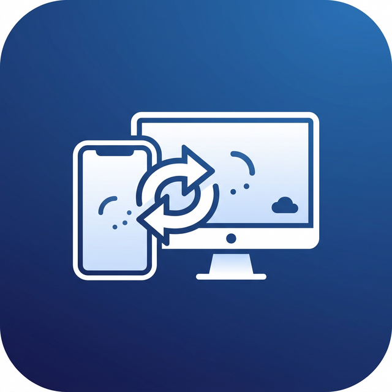

# StremFusion v1.2.0

Professional Android & iOS Device Mirroring and Management Suite.

<div align="center">
  
  <p><b>Mirror. Manage. Master.</b></p>
</div>

---

## 🚀 Overview
StremFusion is a high-performance cross-platform utility designed for developers, streamers, and power users. It provides sub-100ms latency mirroring for Android and iOS devices, integrated file management, and a robust "Smart View" action pipeline.

## ✨ Features
- **Low Latency Mirroring**: Optimized scrcpy integration for fluid Android mirroring (USB/WiFi).
- **iOS Support**: Native iOS mirroring and file system access via `afc-client`.
- **Smart Asset Explorer**: Browse, push, pull, and open mobile files directly with PC applications.
- **Wireless Freedom**: Seamlessly switch between USB and WiFi connection modes.
- **Real-time Synchronization**: Unified clipboard and status monitoring.

## 📦 Quick Installation
1. Download the latest release from the [Releases](https://github.com/MilannSharma/StreamFusion/releases) page.
2. Use `StremFusion-v1.2.0-Portable.exe` for immediate use.
3. Run `StremFusion Setup 1.2.0.exe` for a full system installation.

## 🛠️ Developer Setup
If you want to run the project from source:

### Prerequisites
- **Node.js**: v18 or late
- **ADB Drivers**: For Android devices.
- **Apple Devices/iTunes**: For iOS file support on Windows.

### Steps
1. Clone the repository:
   ```bash
   git clone https://github.com/MilannSharma/StreamFusion.git
   ```
2. Navigate to the Frontend directory:
   ```bash
   cd Frontend
   ```
3. Install dependencies:
   ```bash
   npm install
   ```
4. Start development mode:
   ```bash
   npm run electron:dev
   ```

## 📜 License
© 2026 Milan Sharma. All rights reserved.
Nexus IO Protocol v2.5
